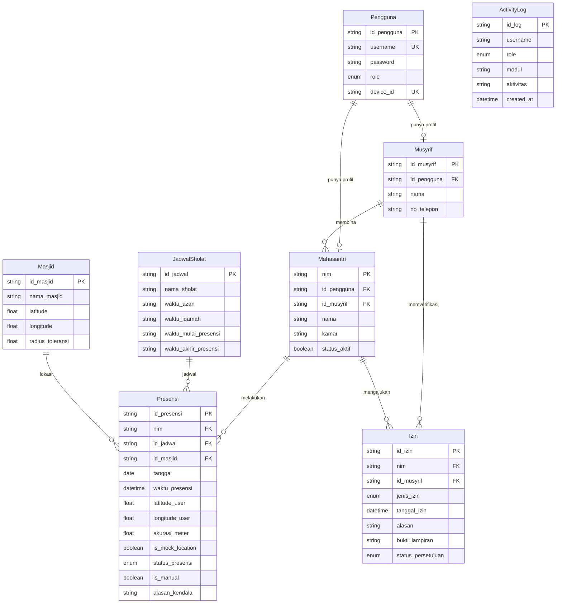

# Database Schema - Geo-Jamaah_Server

Database: PostgreSQL. ORM: Prisma. Primary key memakai UUID, kecuali Mahasantri yang memakai `nim`.

## ERD



`activity_logs` berdiri sendiri (tanpa foreign key). `username` dan `role` disimpan sebagai salinan, supaya log tetap utuh walaupun akun dihapus.

## Daftar Tabel (8)
| No | Tabel | Kategori |
|---|---|---|
| 1 | pengguna | Akun / Auth |
| 2 | mahasantri | Master Data |
| 3 | musyrif | Master Data |
| 4 | jadwal_sholat | Master Data |
| 5 | masjid | Master Data |
| 6 | presensi | Transaksi Utama |
| 7 | izin | Transaksi |
| 8 | activity_logs | Audit Trail |

## Constraint Penting
- `Presensi`: unique `(nim, id_jadwal, tanggal)` untuk mencegah double presensi.
- `Pengguna.username` dan `Pengguna.device_id` unique.
- `activity_logs`: index `(role, created_at)` dan `(username)` untuk laporan audit.
- Hapus `Pengguna` ikut menghapus profil `Mahasantri` / `Musyrif` (cascade).

## Enum
| Enum | Nilai |
|---|---|
| Role | Mahasantri, Musyrif, Admin |
| StatusPresensi | Hadir, Tidak_Hadir, Izin, Manual |
| JenisIzin | Sakit, Pulang, Tugas_Kampus |
| StatusPersetujuan | Pending, Disetujui, Ditolak |

## Prisma Schema

Salin ke `prisma/schema.prisma`.

```prisma
generator client {
  provider = "prisma-client-js"
}

datasource db {
  provider = "postgresql"
  url      = env("DATABASE_URL")
}

enum Role {
  Mahasantri
  Musyrif
  Admin
}

enum StatusPresensi {
  Hadir
  Tidak_Hadir
  Izin
  Manual
}

enum JenisIzin {
  Sakit
  Pulang
  Tugas_Kampus
}

enum StatusPersetujuan {
  Pending
  Disetujui
  Ditolak
}

model Pengguna {
  id_pengguna String      @id @default(uuid())
  username    String      @unique
  password    String      // hash bcrypt
  role        Role
  device_id   String?     @unique
  mahasantri  Mahasantri?
  musyrif     Musyrif?

  @@map("pengguna")
}

model Musyrif {
  id_musyrif  String       @id @default(uuid())
  id_pengguna String       @unique
  nama        String
  no_telepon  String
  pengguna    Pengguna     @relation(fields: [id_pengguna], references: [id_pengguna], onDelete: Cascade)
  mahasantri  Mahasantri[]
  izin        Izin[]

  @@map("musyrif")
}

model Mahasantri {
  nim          String     @id
  id_pengguna  String     @unique
  id_musyrif   String
  nama         String
  kamar        String
  status_aktif Boolean    @default(true)
  pengguna     Pengguna   @relation(fields: [id_pengguna], references: [id_pengguna], onDelete: Cascade)
  musyrif      Musyrif    @relation(fields: [id_musyrif], references: [id_musyrif])
  presensi     Presensi[]
  izin         Izin[]

  @@map("mahasantri")
}

model JadwalSholat {
  id_jadwal            String     @id @default(uuid())
  nama_sholat          String     // Subuh, Dzuhur, Ashar, Maghrib, Isya
  waktu_azan           String     // "HH:mm" (WIB)
  waktu_iqamah         String
  waktu_mulai_presensi String
  waktu_akhir_presensi String
  presensi             Presensi[]

  @@map("jadwal_sholat")
}

model Masjid {
  id_masjid        String     @id @default(uuid())
  nama_masjid      String
  latitude         Float
  longitude        Float
  radius_toleransi Float      // meter
  presensi         Presensi[]

  @@map("masjid")
}

model Presensi {
  id_presensi      String         @id @default(uuid())
  nim              String
  id_jadwal        String
  id_masjid        String
  tanggal          DateTime       @db.Date // tanggal (WIB) untuk proteksi double presensi
  waktu_presensi   DateTime       @default(now())
  latitude_user    Float
  longitude_user   Float
  akurasi_meter    Float?
  is_mock_location Boolean        @default(false)
  status_presensi  StatusPresensi
  is_manual        Boolean        @default(false)
  alasan_kendala   String?

  mahasantri Mahasantri   @relation(fields: [nim], references: [nim])
  jadwal     JadwalSholat @relation(fields: [id_jadwal], references: [id_jadwal])
  masjid     Masjid       @relation(fields: [id_masjid], references: [id_masjid])

  @@unique([nim, id_jadwal, tanggal])
  @@index([nim, tanggal])

  @@map("presensi")
}

model Izin {
  id_izin            String            @id @default(uuid())
  nim                String
  id_musyrif         String
  jenis_izin         JenisIzin
  tanggal_izin       DateTime
  alasan             String
  bukti_lampiran     String?           // object key di MinIO
  status_persetujuan StatusPersetujuan @default(Pending)

  mahasantri Mahasantri @relation(fields: [nim], references: [nim])
  musyrif    Musyrif    @relation(fields: [id_musyrif], references: [id_musyrif])

  @@index([id_musyrif, status_persetujuan])

  @@map("izin")
}

model ActivityLog {
  id_log     String   @id @default(uuid())
  username   String   @db.VarChar(100)
  role       Role
  modul      String   @db.VarChar(100)
  aktivitas  String
  created_at DateTime @default(now())

  @@index([role, created_at])
  @@index([username])
  @@map("activity_logs")
}
```